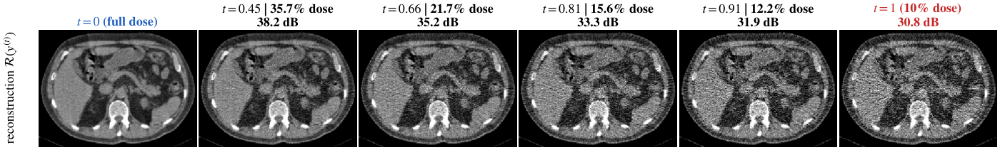
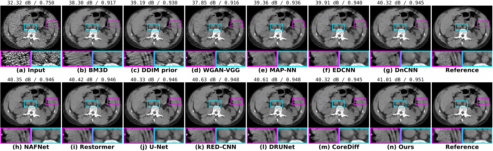
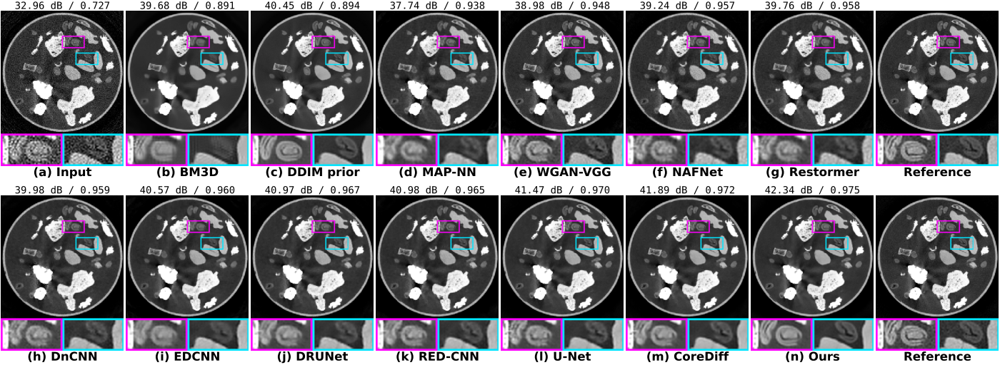

# A Photon-Thinning Bridge for Low-Dose CT Reconstruction

Code for the photon-thinning bridge, a diffusion-style bridge whose forward process is the physics of dose reduction: detected photons are removed by binomial thinning, so every state of the process is distributed as a scan acquired at a lower dose. A fixed reconstruction operator turns the thinned counts into a trajectory of valid CT images, and a dose-conditioned network learns to reverse it. Because the bridge time is a physical relative exposure, one checkpoint covers a calibrated range of doses.



*Forward process on a Mayo LDCT slice (alpha = 0.1). Each panel is a reconstruction at the dose written above it, from the full-dose scan to the 10%-dose input.*

## Results

At the training dose (2DeteCT alpha = 0.01, 100 test slices; LDCT alpha = 0.1, 688 test slices). Every method is evaluated at the dose it was trained on.

| Method | 2DeteCT PSNR | SSIM | VIF | LDCT PSNR | SSIM | VIF |
|---|---|---|---|---|---|---|
| Low-dose input | 32.69 | 0.737 | 0.512 | 33.36 | 0.799 | 0.562 |
| BM3D | 38.71 | 0.876 | 0.679 | 37.01 | 0.902 | 0.645 |
| U-Net (FBPConvNet) | 40.94 | 0.965 | 0.727 | 40.44 | 0.954 | 0.715 |
| DnCNN | 39.16 | 0.946 | 0.685 | 40.26 | 0.953 | 0.710 |
| RED-CNN | 40.40 | 0.957 | 0.715 | 40.69 | 0.955 | 0.721 |
| WGAN-VGG | 38.14 | 0.939 | 0.668 | 37.30 | 0.924 | 0.632 |
| MAP-NN | 36.51 | 0.929 | 0.635 | 39.05 | 0.945 | 0.677 |
| EDCNN | 39.63 | 0.948 | 0.704 | 39.83 | 0.949 | 0.697 |
| DRUNet | 40.24 | 0.959 | 0.710 | 40.73 | 0.955 | 0.722 |
| NAFNet | 38.46 | 0.945 | 0.657 | 40.37 | 0.954 | 0.712 |
| Restormer | 39.14 | 0.950 | 0.668 | 40.47 | 0.954 | 0.715 |
| Diffusion prior, DDIM | 39.34 | 0.877 | 0.698 | 38.39 | 0.923 | 0.673 |
| CoreDiff | 41.39 | 0.967 | 0.737 | 40.32 | 0.953 | 0.712 |
| **Ours** | **41.87** | **0.970** | **0.755** | **41.09** | **0.958** | **0.733** |

Out-of-simulation data, trained on simulated thinning data only: the official Mayo reduced-dose projections at 10% of routine dose, and 2DeteCT scans acquired at 3.3% tube current.

| Method | LDCT 10% PSNR | SSIM | VIF | 2DeteCT 3.3% PSNR | SSIM | VIF |
|---|---|---|---|---|---|---|
| Low-dose input | 30.75 | 0.719 | 0.487 | 25.48 | 0.485 | 0.395 |
| BM3D | 35.83 | 0.893 | 0.614 | 28.86 | 0.721 | 0.567 |
| U-Net (FBPConvNet) | 38.72 | 0.940 | 0.672 | 29.99 | 0.857 | 0.642 |
| RED-CNN | 39.27 | 0.946 | 0.686 | 29.94 | 0.859 | 0.632 |
| DRUNet | 39.19 | 0.946 | 0.684 | 29.99 | 0.860 | 0.626 |
| CoreDiff | 38.72 | 0.940 | 0.669 | 29.89 | 0.854 | 0.624 |
| **Ours** | **39.57** | **0.947** | **0.695** | **30.22** | **0.872** | **0.671** |

Across the dose sweep (2DeteCT 1-40%, LDCT 10-36%) one bridge checkpoint, queried with the known dose, stays above the best network retrained at each dose by +0.09 to +0.43 dB on 2DeteCT and +0.11 to +0.14 dB on LDCT, while networks trained at a single dose lose up to 8 dB away from it.





## Repository layout

```
train_2detect_dose_bridge.py   thinning, trajectory precomputation and training on 2DeteCT
train_ldct_dose_bridge.py      the same pipeline on Mayo LDCT
estimate_photon_counts.py      blank-scan intensity and Fano factor calibration
unified_eval.py                shared network definitions and metrics
eval_real_lowdose.py           reconstruction helpers for the real low-dose scans
baselines/
  train_bridge.py                  training entry point (bridge network and single-dose controls)
  train_baselines.py           baseline architectures and their training loop
  train_boosters.py            bridge datasets, dose-free wrapper, interpolation control
  train_wgan_vgg.py            WGAN-VGG with its published patch recipe
  eval_all.py                  evaluation at the training dose
  eval_dose_sweep.py           evaluation across the dose sweep
  analyze_sweep.py             regret against the best per-dose network
  eval_real_all.py             evaluation on the real low-dose scans
  eval_sampler_variants.py     reverse-step coefficients and multi-step samplers
  eval_bm3d.py                 BM3D with the dose-matched noise level
  eval_diffusion_baselines.py  image-domain DDIM denoiser on a diffusion prior
  estimate_query_t.py          reference-free query time from the input noise level
  make_tables.py            result tables
  plot_dose_sweep.py           PSNR against dose
  precompute_*.py              extra thinning realizations and off-grid test doses
  figs/                     figure scripts
```

## Setup

```bash
conda create -n dosebridge python=3.9
conda activate dosebridge
pip install -r requirements.txt
```

The projector uses the ASTRA toolbox and a CUDA GPU. `bm3d`, `piq` and `lpips` are needed only for the corresponding baselines and metrics.

The diffusion-prior baseline loads an external guided-diffusion implementation and checkpoint; point `DIFFUSION_BASELINES` at that directory before running `baselines/eval_diffusion_baselines.py`.

## Data

- **2DeteCT**: 1,000 experimentally acquired fan-beam slices (Kiss et al., 2023), with the mode-1 low-current scans used for the real-data evaluation.
- **Mayo LDCT**: helical chest projections of 29 patients, rebinned to fan-beam geometry, and the official reduced-dose projections at 10% of routine dose.

Point the code at the directory holding both datasets:

```bash
export DOSE_BRIDGE_DATA=/path/to/data
```

## Reproducing the results

Precompute the thinned trajectories once per dataset and schedule:

```bash
python train_2detect_dose_bridge.py --precompute --n_steps 5 --I0_high 1e5 --I0_low 1e3
python train_ldct_dose_bridge.py --precompute --n_steps 5 --I0_high 1e5 --I0_low 1e4
python baselines/precompute_rep4_2detect.py      # additional thinning realizations
python baselines/precompute_rep_ldct.py
python baselines/precompute_offgrid_2detect.py   # test doses outside the training grid
```

Train the bridge network (96 base channels on 2DeteCT, 64 on LDCT):

```bash
python baselines/train_bridge.py --arch hybrid96 --mode bridge --experiment 2detect_rep4 \
       --schedule uniform --aug --ema --lr 2e-4 --epochs 80
python baselines/train_bridge.py --arch hybrid --mode bridge --experiment ldct_rep4 \
       --schedule uniform --aug --ema --lr 2e-4 --epochs 21
```

Train a single-dose baseline with the same recipe, for instance RED-CNN:

```bash
python baselines/train_bridge.py --arch redcnn --mode endpoint --experiment 2detect --epochs 100
```

Evaluate and build the tables:

```bash
python baselines/eval_all.py --dataset 2detect          # training dose
python baselines/eval_dose_sweep.py --dataset 2detect   # dose sweep
python baselines/analyze_sweep.py --dataset 2detect     # regret per dose
python baselines/eval_real_all.py --dataset ldct        # real low-dose scans
python baselines/make_tables.py
```

Figures are produced by `baselines/figs/make_fig_trajectory_lsmr.py` and
`baselines/figs/make_fig_recon_rdm.py`.

## Citation

```bibtex
@inproceedings{xie2027photon,
  title     = {A Photon-Thinning Bridge for Low-Dose {CT} Reconstruction},
  author    = {Xie, Shiyu and Entezari, Alireza and Banerjee, Arunava},
  booktitle = {IEEE International Conference on Acoustics, Speech and Signal Processing (ICASSP)},
  year      = {2027},
  note      = {Under review}
}
```

## License

MIT
